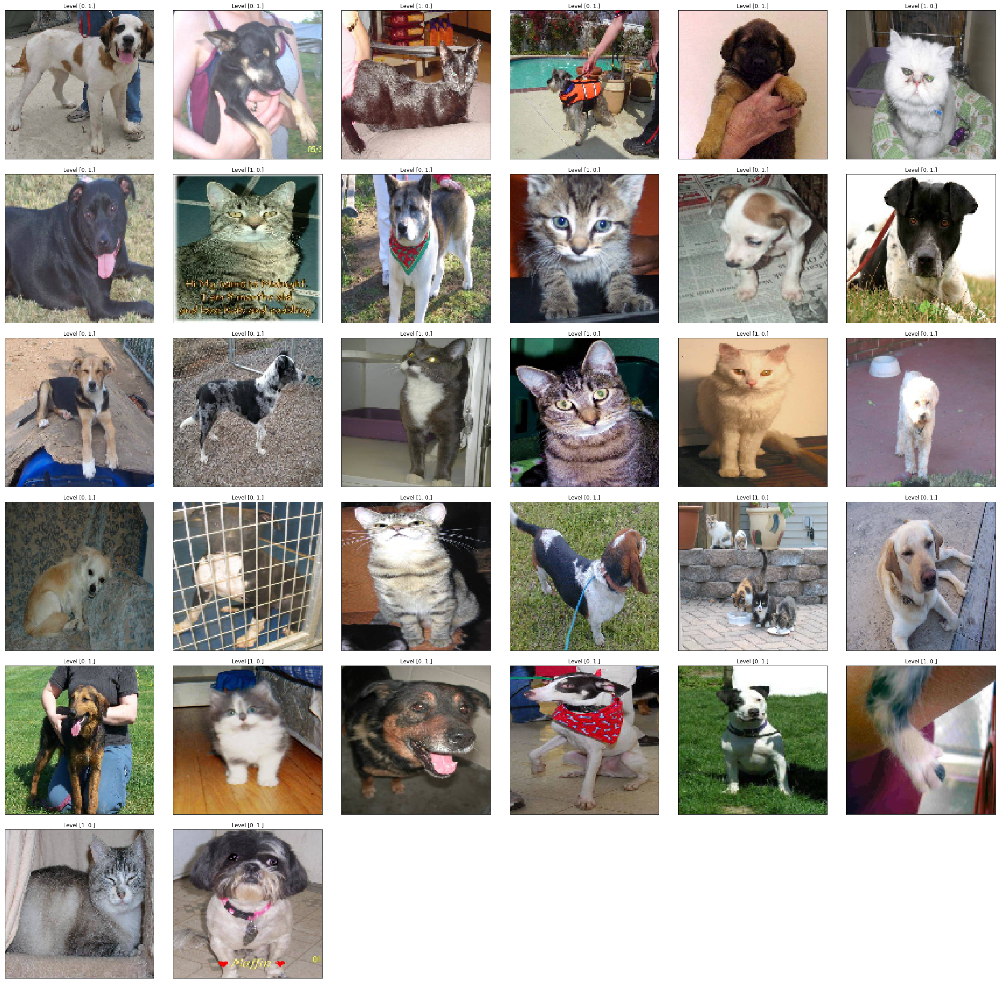
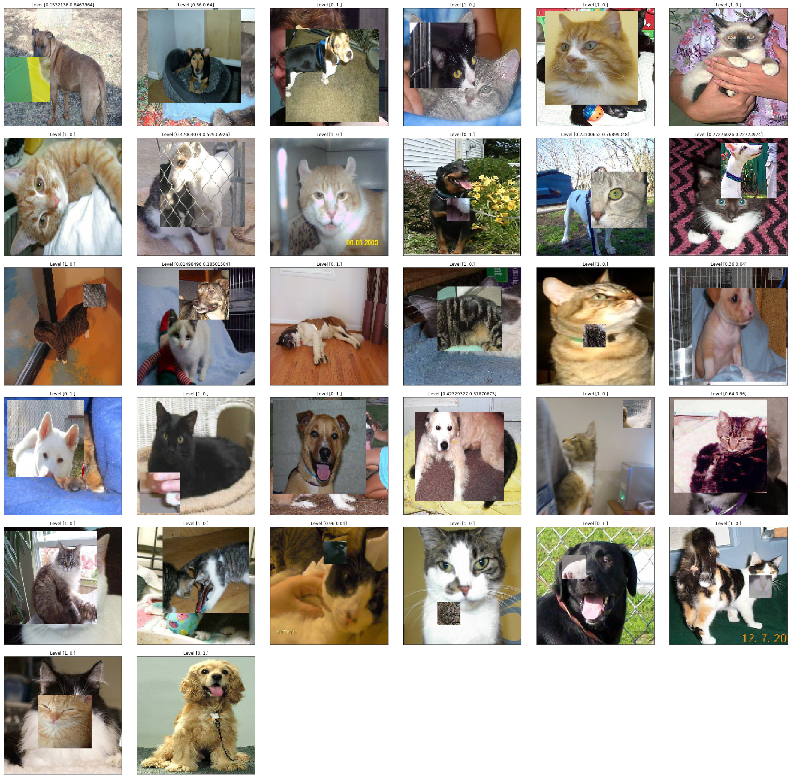
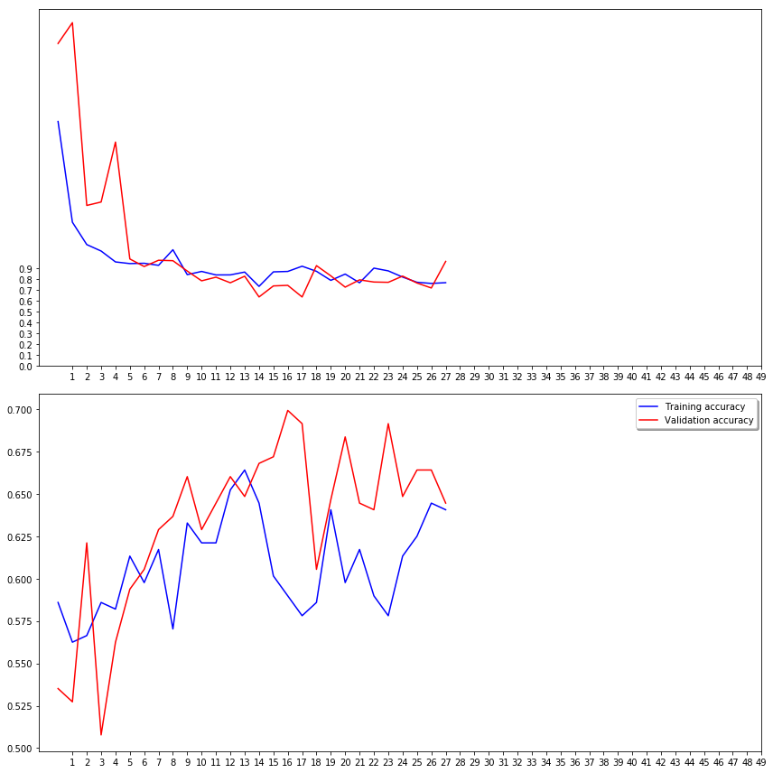
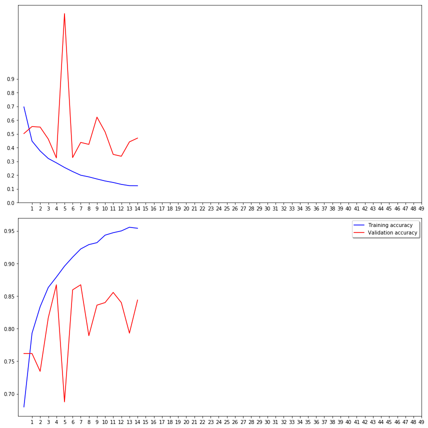

<h1 align="center">
  <b>CutMix-Regularization</b><br>
</h1>

<p align="center">
      <a href="https://www.python.org/">
        </a>
       <a href= "https://github.com/AntixK/PyTorch-VAE/blob/master/LICENSE.md">
        </a>

</p>
Through this project we will try to understand CutMix Paper by implementing it on a simple problem of cat-vs-dog classification. 

## Implementation
I have used keras to implement the cutmix augmentation. 
Dataset used: https://www.kaggle.com/competitions/dogs-vs-cats/data. <br>
In CutMix we mix two images and their labels respectively in order to generate new data point. So I have created a custom datagenerator. This custom datagenerator takes batches from two seperate keras datagenerator and returns one batch by applying cutmix on it.<br>
>train datagenerator (custom) 
```
train_dataset = CutMixImageDataGenerator(
    generator1= train_datagen1, #train_generator1,
    generator2= train_datagen2, #train_generator2,
    img_size=128,
    batch_size=32,
)
```
>valid datagenerator (default) 
```
valid_dataset = valid_datagen.flow_from_dataframe(
    dataframe=validate_df,
    directory=image_path,
    target_size=(128, 128), 
    x_col='filename', 
    y_col='category',
    batch_size=32,
    seed=42,
    shuffle=True,
    class_mode="categorical",  
    )
```    

## Results
Type            |  Without CutMix              |  With CutMix
:------------:|:-------------------------:|:-------------------------:
Cutmix Output |            |  
Training and Validation Accuracy plot|            |  
Score | loss: 0.7671 - acc: 0.6406 <br> val_loss: 0.9630 - val_acc: 0.6445 | loss: 0.1226 - acc: 0.9538 <br> val_loss: 0.4688 - val_acc: 0.8438
#epochs | 50 | 50
Early Stop | 28 | 15

## Conclusion
We have two notebooks ```1. Without CutMix``` and ```2. With CutMix```. Both notebooks have everything exactly same(```seed, batchsize, #epochs, rescaling etc```) only except the training datagenerator. And we notice that using CutMix augmentation has really improved the ```validation score``` making the model more regularized and robust in comparision to model which is trained without using CutMix augmentation.
## Reference
- original paper: https://arxiv.org/abs/1905.04899
